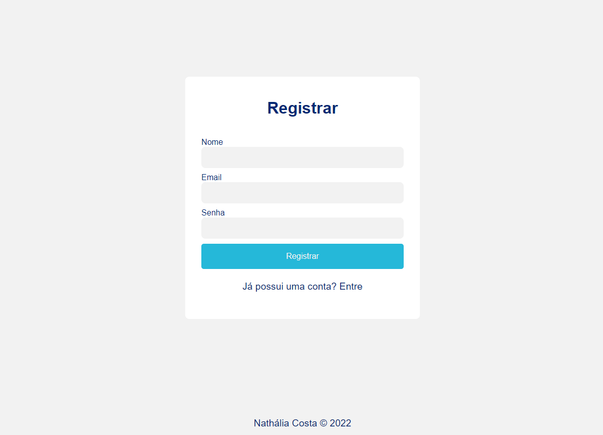

# MedManage
 
## Descrição	

Este projeto foi desenvolvido como parte do processo seletivo para a vaga de desenvolvedora na empresa [*Empresa anonima*](**). O desafio proposto foi desenvolver uma aplicação web para o cadastro de medicamentos. O usuário deveria ser capaz de cadastrar, editar e excluir medicamentos. O usuário também deveria ser capaz de visualizar uma lista com todos os medicamentos cadastrados.

## Indice

* [Instalação](#instalação)
* [Acesso](#acesso)
* [Telas](#telas)
* [Tecnologias](#tecnologias)
* [Desafios e aprendizados](#desafios-e-aprendizados)
* [O que pode ser melhorado](#o-que-pode-ser-melhorado)
* [Perguntas](#perguntas)


## Instalação

1. Certifique-se de ter o Docker e o Docker Compose instalados em sua máquina.
2. Faça o clone do repositório do projeto em sua máquina.
3. No terminal, navegue até o diretório do projeto e execute o seguinte comando para subir os containers do Docker:

```
docker-compose up
```

4. Aguarde até que todos os containers estejam em execução.
5. Abra o navegador e acesse a aplicação através do endereço http://localhost:3000/.

## Acesso

Para acessar a aplicação, utilize as seguintes credenciais:

```
Usuário: admin
Senha: password123
```

## Telas

### Tela de login


### Tela do dashboard


### Tela de cadastro de medicamentos


### Tela de lista de medicamentos


### Tela de detalhes de medicamentos


### Tela de cadastro de usuários



### Tela de lista de usuários


## Tecnologias

* [Docker](https://www.docker.com/)
* [Docker Compose](https://docs.docker.com/compose/)
* [PostgreSQL](https://www.postgresql.org/)
* [Python](https://www.python.org/)
* [Node.js](https://nodejs.org/en/)
* [Next.js](https://nextjs.org/)
* [TypeScript](https://www.typescriptlang.org/)


## Desafios e aprendizados

Nunca havia implementado o Docker e Docker Compose do zero antes, então foi um desafio aprender a configurar os containers e os serviços. Também foi um desafio aprender a utilizar o Next.js, pois nunca havia trabalhado com essa tecnologia antes. Aprendi bastante sobre o Next.js e sobre o Docker e Docker Compose durante o desenvolvimento do projeto. Essa também foi a primeira vez que desenvolvi uma aplicação Backend utilizando o Python, então foi um desafio aprender a utilizar essa tecnologia também.

Tudo isso foi muito enriquecedor para mim, pois pude aprender bastante sobre tecnologias que eu nunca havia utilizado antes. Acredito que o desafio foi cumprido com sucesso, pois consegui desenvolver uma aplicação funcional e que atende aos requisitos propostos.


## O que pode ser melhorado:

* Implementar testes unitários e de integração.
* Implementar testes de interface.
* Implementar a funcionalidade de paginação da lista de medicamentos.
* Implementar a funcionalidade de ordenação da lista de medicamentos.
* Implementar a funcionalidade de filtro da lista de medicamentos.
* Implementar a funcionalidade de edição de usuários.
* Implementar a funcionalidade de exclusão de usuários.
* Implementar a funcionalidade de recuperação de senha.
* Implementar a funcionalidade de envio de e-mail para recuperação de senha.
* Implementar a funcionalidade de alteração de senha.
* Implementar a funcionalidade de envio de e-mail para alteração de senha.
* Implementar a funcionalidade de envio de e-mail para confirmação de cadastro.
* Implementar a funcionalidade de confirmação de cadastro.
* Implementar o envio das imagens dos medicamentos para o S3.
* Implementar a funcionalidade de edição de medicamentos.


## Perguntas

Se você tiver alguma dúvida sobre o repositório, abra uma issue ou entre em contato comigo diretamente em [nathliac.dev@gmail.com](mailto:nathaliac.dev@gmail.com). Você pode encontrar mais do meu trabalho em [github](https://github.com/Nthliacc)

